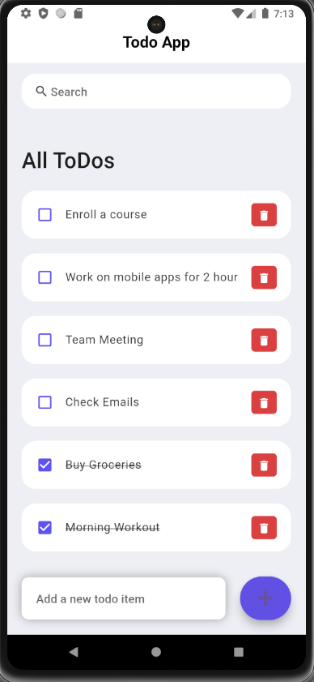

# TodoList App

A simple to-do list app built with Flutter. This app allows users to create, manage tasks efficiently.

## Features

- Create tasks to the list.
- Mark tasks as completed or delete them.
- User-friendly interface for easy task management.

## Screenshots

